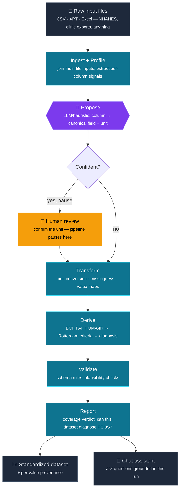

# PCOS Schema Mapper — Architecture

One pipeline: an LLM *proposes* how to map a raw dataset onto the canonical PCOS schema, a human confirms it only when the pipeline is genuinely stuck, and deterministic code does every calculation. No model ever touches a number.

**The one thing to say out loud:** the LLM only labels columns and units — it never converts, derives, or diagnoses. Everything below the propose step is deterministic, auditable Python, so the same reviewed mapping always produces the same output.
