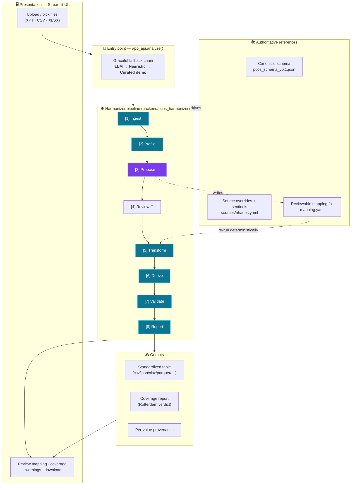
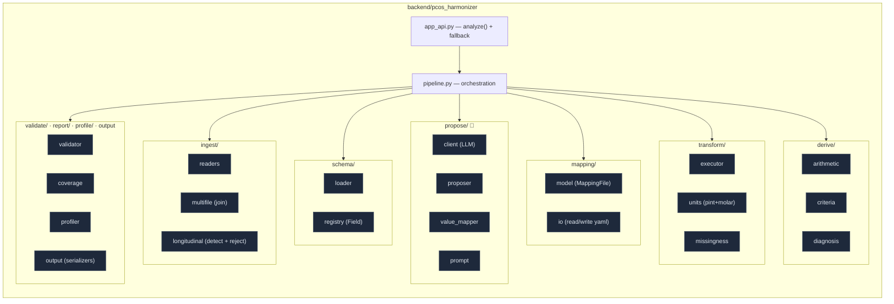

# PCOS Harmonizer — Architecture

Standardizes messy clinical datasets (NHANES XPT, CSV, Excel) into one **auditable,
reproducible** PCOS canonical schema.

> **Core design claim:** the LLM only *proposes* mappings. Every numeric value is
> produced by deterministic code. There is a **hard boundary** between step [3]
> (propose) and step [5] (transform) — no model call touches the numeric path.

---

## 1. System overview



🤖 = LLM-assisted (proposal only)  ·  👤 = human review  ·  everything else is deterministic.

---

## 2. The pipeline in detail (the LLM ↔ deterministic boundary)

```mermaid
flowchart LR
    IN[("Input files")] --> I

    subgraph PROPOSE["PROPOSAL SIDE — non-numeric"]
        direction TB
        I["[1] ingest<br/><i>ingest/readers · multifile</i><br/>read + join on shared key (SEQN)"]
        PR["[2] profile<br/><i>profile/profiler</i><br/>dtype · nulls · ranges · unit signals"]
        PP["[3] propose<br/><i>propose/proposer · value_mapper</i><br/>column → canonical field + unit_raw"]
        I --> PR --> PP
    end

    PP --> MF{{"mapping.yaml<br/>mappings · unmapped · blocked"}}
    MF --> HR["[4] human review<br/>sets human_reviewed: true"]

    subgraph EXEC["EXECUTION SIDE — deterministic, no LLM"]
        direction TB
        TR["[5] transform<br/><i>transform/executor</i><br/>units (pint + molar) · missingness · enums"]
        DV["[6] derive<br/><i>derive/arithmetic · criteria · diagnosis</i><br/>BMI · FAI · HOMA-IR → criterion flags → Dx"]
        VA["[7] validate<br/><i>validate/validator</i><br/>x_validator_rules"]
        RP["[8] report<br/><i>report/coverage</i><br/>coverage + verdict"]
        TR --> DV --> VA --> RP
    end

    HR --> TR
    RP --> RES[("Standardized table<br/>+ coverage + provenance")]

    OV[["sources/nhanes.yaml<br/>overrides · sentinels"]] -. precedence 1.0 .-> PP
    SC[["pcos_schema_v0.1.json<br/>field registry"]] -. schema/loader .-> PP
    SC -. .-> TR
    SC -. .-> VA

    classDef boundary stroke-dasharray:6 6,stroke-width:3px,stroke:#f59e0b;
    class MF,HR boundary;
```

**Two entry paths through the same executor**
- `run_pipeline()` — full run: ingest → profile → propose → transform → derive → validate → report.
- `run_from_mapping()` — deterministic re-run of steps [5]–[8] from a reviewed
  `mapping.yaml`. Same mapping ⇒ byte-identical output.

---

## 3. Component / module map



---

## 4. Key architectural decisions

| Decision | Where | Why it matters |
|---|---|---|
| **LLM proposes, code executes** | boundary between [3] and [5] | The "auditable, not a black box" pitch. No model arithmetic in the numeric path. |
| **Reviewable mapping file** | `mapping/` → `mapping.yaml` | Human-editable contract; re-runs are byte-identical. |
| **Units via `pint` + molar mass** | `transform/units.py` | 13 molar masses replace ~50 pairwise factors; extends automatically. |
| **Block, don't guess** | proposer / transform | Ambiguous unit ⇒ `BLOCKED_UNIT_UNKNOWN`; refuses rather than corrupts. |
| **Source overrides win** | `sources/nhanes.yaml` | Known-source variable codes beat LLM inference (confidence 1.0). |
| **Provenance per value** | throughout | `value_raw`, `unit_raw`, `transformation_applied` retained for verification. |
| **Graceful degradation** | `app_api.analyze()` | LLM → heuristic → curated demo, so the live demo always produces a result. |
| **Coverage verdict is the product** | `report/coverage.py` | Answers "can this dataset support a Rotterdam diagnosis?" — a failing dataset is a valid result. |
